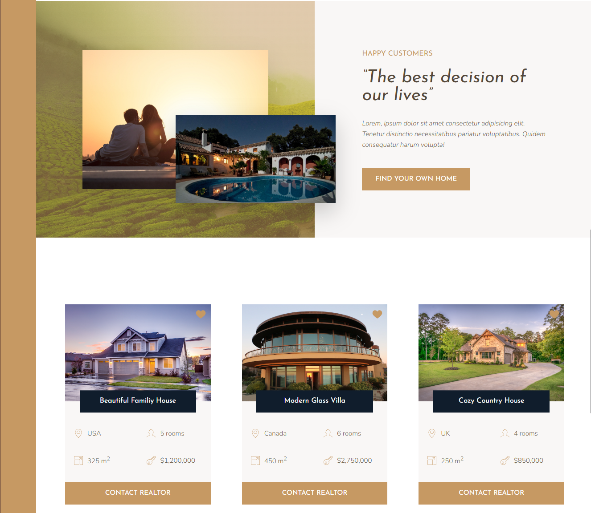
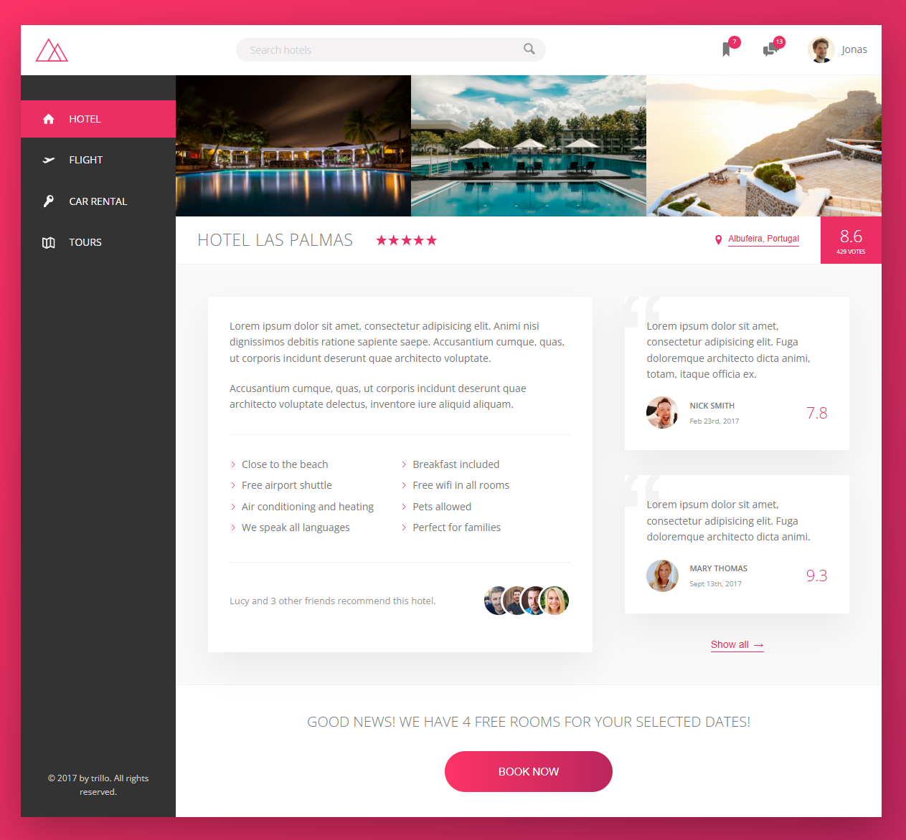
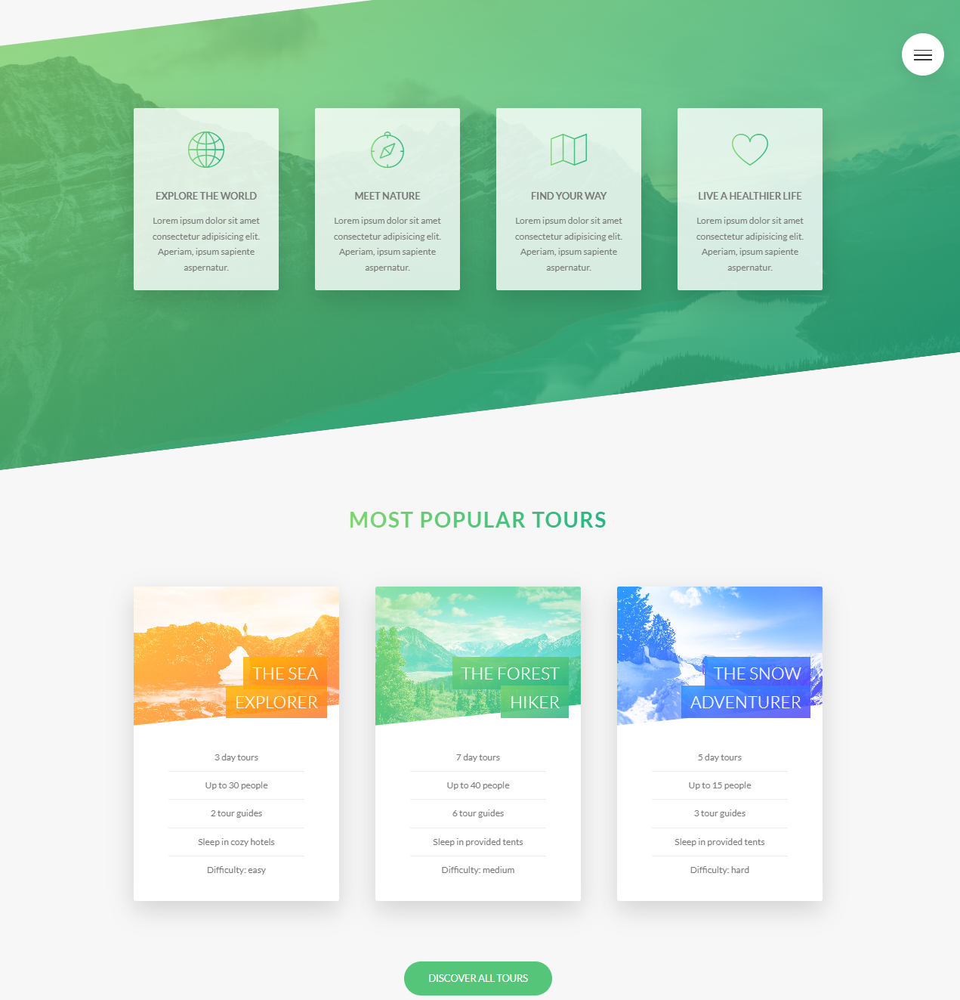

# Advanced CSS Projects

This repository contains three projects from an **Advanced CSS** Udemy course.  
Each project focuses on mastering advanced CSS concepts, including **flexbox**, **grid layout**, **animations**, and **responsive design**.

## 🚀 Projects Overview

### 1. **Nexter**  
A **real estate landing page** showcasing advanced **CSS animations**, **form styling**, and **responsiveness**.

- **Technologies**: HTML, CSS, Flexbox, Animations  
- **Key Features**: Interactive property cards, smooth page transitions, and mobile-first design.

### 2. **Trillo**  
A fully responsive **hotel booking website** designed to demonstrate **CSS Grid** and **responsive typography**.

- **Technologies**: HTML, CSS, Grid, Responsive Design  
- **Key Features**: Fully responsive layout, sleek design with well-structured components.

### 3. **Natours**  
A modern **travel website** showcasing advanced CSS techniques such as **flexbox**, **grid**, and **CSS animations**.

- **Technologies**: HTML, CSS, Flexbox, Grid, Animations  
- **Key Features**: Responsive design, image hover effects, and animated transitions.

## 📅 Project Details
- **Course**: Udemy - Advanced CSS and Sass: Flexbox, Grid, Animations and More!
- **Year**: 2023
- **Technologies**: HTML, CSS, Flexbox, Grid, Animations, Responsive Design  

---

⭐ These are learning projects and are not actively maintained.
